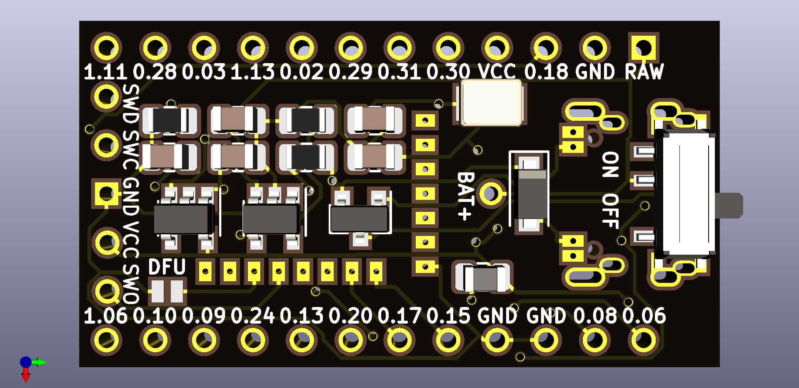
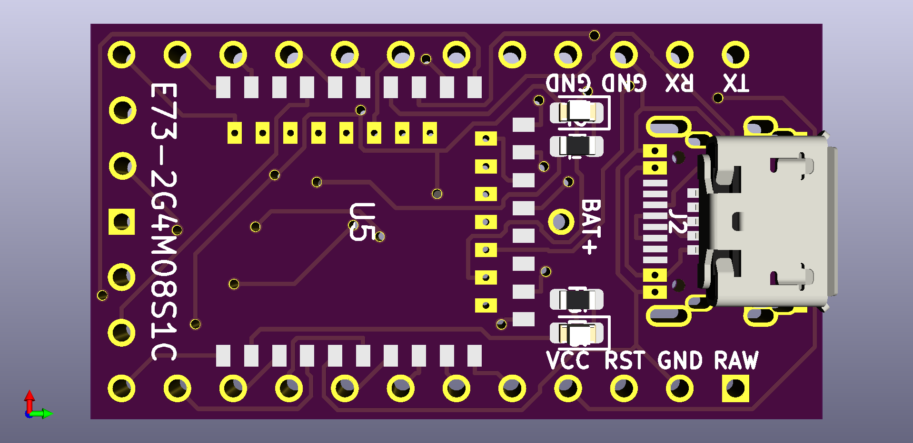

# nrfmicro

Arduino Pro Micro-sized breakout board for E73-2G4M08S1C (nRF52840) modules

## Disclaimer

UNTESTED! DO NOT ORDER!

A double-layer board this size is very limiting so I had to remap GPIO pins to the closest physical positions.
I'm still figuring out the best layout and pin options.
Supposed to be used with a modified Adafruit Feather nRF52840 Express bootloader.

## Revisions

### Version 0.1 (rev0)

#### Features

* Same size as a regular Pro Micro
* USB Type-C and MicroUSB support
* Optional LIR2032 holder (BS-7)
* Optional ON/OFF switch (MSK-12C02)
* Optional Crystal (2-pin, 32.768khz)
* Optional Inductor (0805 package, 10uH)
* AP2112K-3.3-based (SOT-23) power switch
* MCP73831-based charger (SOT-23)

#### Pictures

## References

* [Adafruit Feather nRF52840 Express module (see reference schematics there)](https://www.adafruit.com/product/4062)
* [CDEBYTE E73-2G4M08S1C-nRF52840 module ($7.39 on Aliexpress)](https://www.aliexpress.com/item//32944356249.html)
* https://github.com/adafruit/Adafruit_nRF52_Bootloader
* https://github.com/jpconstantineau/NRF52-Board
* https://github.com/jpconstantineau/BlueMicro_BLE
